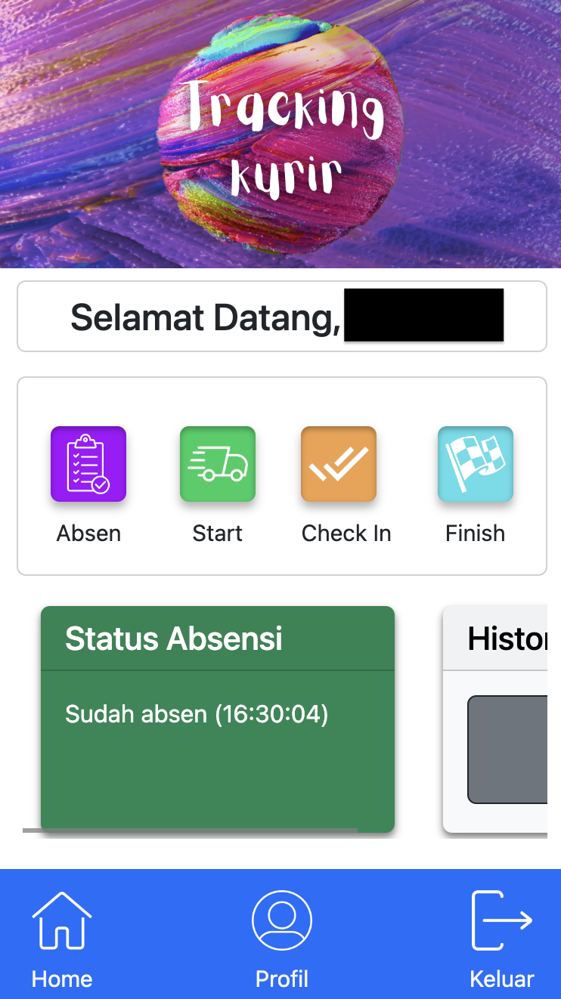
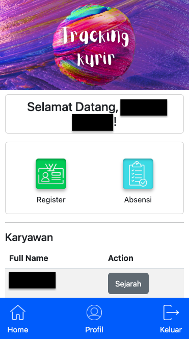
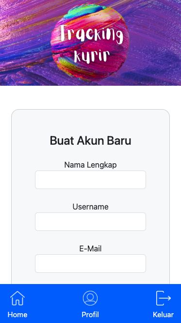
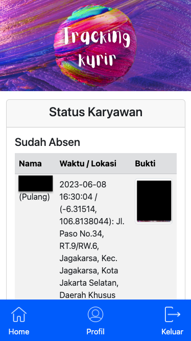
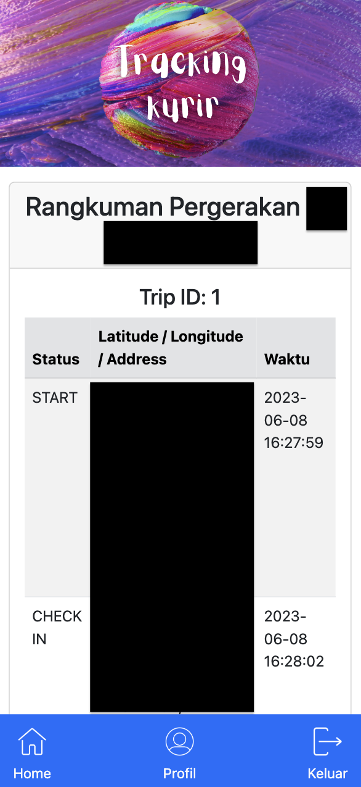
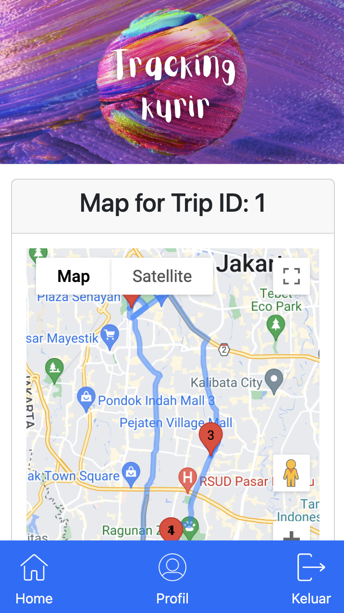
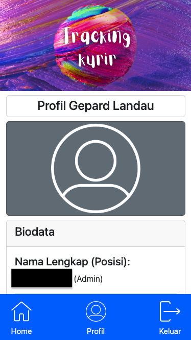

# Aplikasi Tracking Kurir

This web application was developed during my internship with Safari Masraya and aims to manage a spare-parts courier company's workers through setting up a cloud-based attendance system accessible through phone and desktop. Accessible from the workers' side who log in to attendance and log their current location and also from the admin side who can log in new workers and keep track of attendance and current locations of courier workers. Language of usage is Bahasa Indonesia. The test deployment site is no longer running due to the deactivation of the Google Maps API Key; please refer to this ReadME.

## Feature overview

#### General features
- User registration
- User login
- View personal account details

#### Worker flow
- Log in to work
- Log out from work
- Geotagged check in/out at any location
- View own history of movement
- View status of attendance

#### Admin flow
- Create new worker user profiles
- Keep track of worker's current and past location(s)
- Keep track of workers' attendance

## How to Log in to/out of Work
1. Login or register as a worker 
2. Press the 'Absen'/'Pulang' button
3. Upload a photo or use the webcam to choose a proof of attendance
4. Press the 'Kirim' button

## How to Log current location
1. After logging in to work, press the start button in the Home page
2. Then use the Check in/Check out button to update current location (specifically at any stops made throughout the journey
3. Once the user is back at the office and before logging off of work, press finish

## How to View movement history and status of attendance
1. A card is present to show status of attendance (i.e. attended today or otherwise)
2. Next to it is a card with a button to show history of movements; click it and a collection of tables representing trips will be shown
3. Below each table there will be a button that will generate a map for the specific trip

## How to Create new worker user
1. Press the register button in home and fill in the form then press submit

## How to keep track of worker's location(s)
1. At the bottom of the home page there is a table of all the workers
2. Next to the names there are buttons to show history of movements; click it and a collection of tables representing trips to the corresponding worker
3. Below each table there will be a button that will generate a map for the specific trip

## How to keep track of worker's attendance
1. Click the Absensi button in the home page
2. After being redirected two tables will be shown
3. The first table shows all workers who have done attendance or went home and shows their location and time when they logged/in, along with photo proof
4. For small screens, click on the images to enlarge
5. The second table lists out all the workers who have yet to do. attendance for the day

## Screenshots
*Note: Black boxes function to censor sensitive information such as full names, faces, and specific coordinate locations

### Worker Flow

#### Home Page 

#### Attendance Detail/Proof Upload Page 

### Admin Flow

#### Home Page

#### Register New Worker

#### Attendance Records

### Both Flows

#### Movement History

#### Map Interface 

#### Profile Interface 

## Tools and libraries

- OpenLayers
- jQuery
- SweetAlert
- Bootstrap
- Google Maps API
- LightBox
